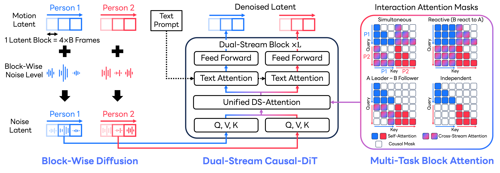

# InterCMDM

This repository contains materials developed by LY Corporation and is temporarily open-sourced for the purpose of [our reseach project](https://yu1ut.com/InterCMDM-HP/).
 
- **Temporary Release**: This repository is temporarily available as open-source. Therefore this repository may be turn into read-only or private anytime.
- **Attribution**: All code and materials in this repository are owned by LY Corporation.

## Project Overview

Code of the paper "InterCMDM: Block-Causal
Diffusion for Autoregressive Human Interaction Generation" (ECCV 2026). 
InterCMDM generates autoregressive two-person interactions with a block-causal
diffusion model.
<div align="center">


[](https://arxiv.org/abs/2607.01743)
[](https://yu1ut.com/InterCMDM-HP/)
[](http://creativecommons.org/publicdomain/zero/1.0/)
</div>

## ⚙️ Getting Started

<details>
<summary><b>Installation, checkpoints, and data</b></summary>


### 1. Python environment using uv

InterCMDM requires Python 3.10.9. Install the locked environment with:

```bash
uv sync
```

### 2. Download evaluation models

Download the evaluator checkpoints provided by the [InterMask repository](https://github.com/gohar-malik/intermask) and
place them in `checkpoints/`.

### 3. Datasets

Download the [InterHuman](https://github.com/tr3e/intergen) and [Inter-X](https://github.com/liangxuy/Inter-X) datasets following the instructions in the
[InterMask repository](https://github.com/gohar-malik/intermask). Arrange the repository as follows:

```text
InterCMDM
├── checkpoints
│   ├── eval_model
│   └── hhi
├── data
│   ├── InterHuman
│   └── Inter-X_Dataset
├── models
├── options
├── utils
├── eval_inter_cmdm.py
├── train_inter_cmdm.py
└── train_tae.py
```

</details>

## 📖 Train InterCMDM

<details>
<summary><b>Train InterCMDM models</b></summary>

### Train the Temporal VAE

InterHuman:

```bash
uv run python train_tae.py \
  --gpu_id 0 \
  --dataset_name interhuman \
  --name tae \
  --batch_size 256 \
  --max_epoch 100
```

Inter-X:

```bash
uv run python train_tae.py \
  --gpu_id 0 \
  --dataset_name interx \
  --name tae \
  --batch_size 256 \
  --feature_dim 336 \
  --max_epoch 100
```

### Train the DS-Causal-DiT

InterHuman:

```bash
uv run python train_inter_cmdm.py \
  --gpu_id 0 \
  --dataset_name interhuman \
  --name inter_cmdm \
  --vq_name tae \
  --batch_size 64 \
  --max_epoch 500
```

Inter-X:

```bash
uv run python train_inter_cmdm.py \
  --gpu_id 0 \
  --dataset_name interx \
  --name inter_cmdm \
  --vq_name tae \
  --batch_size 64 \
  --max_epoch 500
```

</details>

## 🎆 Evaluate InterCMDM

<details>
<summary><b>Evaluate InterCMDM models</b></summary>

### Evaluate the Temporal VAE

InterHuman:

```bash
uv run python eval_inter_cmdm.py \
  --gpu_id 0 \
  --dataset_name interhuman \
  --name tae \
  --use_trans false
```

Inter-X:

```bash
uv run python eval_inter_cmdm.py \
  --gpu_id 0 \
  --dataset_name interx \
  --name tae \
  --use_trans false
```

### Evaluate the DS-Causal-DiT

InterHuman:

```bash
uv run python eval_inter_cmdm.py \
  --gpu_id 0 \
  --dataset_name interhuman \
  --name inter_cmdm \
  --cond_scales 3
```

Inter-X:

```bash
uv run python eval_inter_cmdm.py \
  --gpu_id 0 \
  --dataset_name interx \
  --name inter_cmdm \
  --cond_scales 1.5
```

</details>

## Acknowledgements

The data preparation and evaluation setup build on the InterHuman, Inter-X, and
InterMask projects. We thank their authors for making their work available.

## Citation

If you find this project useful, please cite our paper.
```bibtex
@inproceedings{intercmdm2026,
  title     = {InterCMDM: Block-Causal Diffusion for Autoregressive Human Interaction Generation},
  author    = {Yu, Qing and Fujiwara, Kent},
  booktitle = {European Conference on Computer Vision (ECCV)},
  year      = {2026}
}
```

## Contributions
 
As this project is temporarily open-sourced, we are not accepting contributions. For feedback or inquiries, please open an issue in this repository.

## License
 
This code is dedicated to the public domain under [CC0 1.0](https://creativecommons.org/publicdomain/zero/1.0/). 
You may copy, modify, and distribute it without restriction, and the authors make no warranties or guarantees regarding its use.

Additionally, this repository contains third-party software. Refer [NOTICE.txt](NOTICE.txt) for more details and follow the terms and conditions of their use.